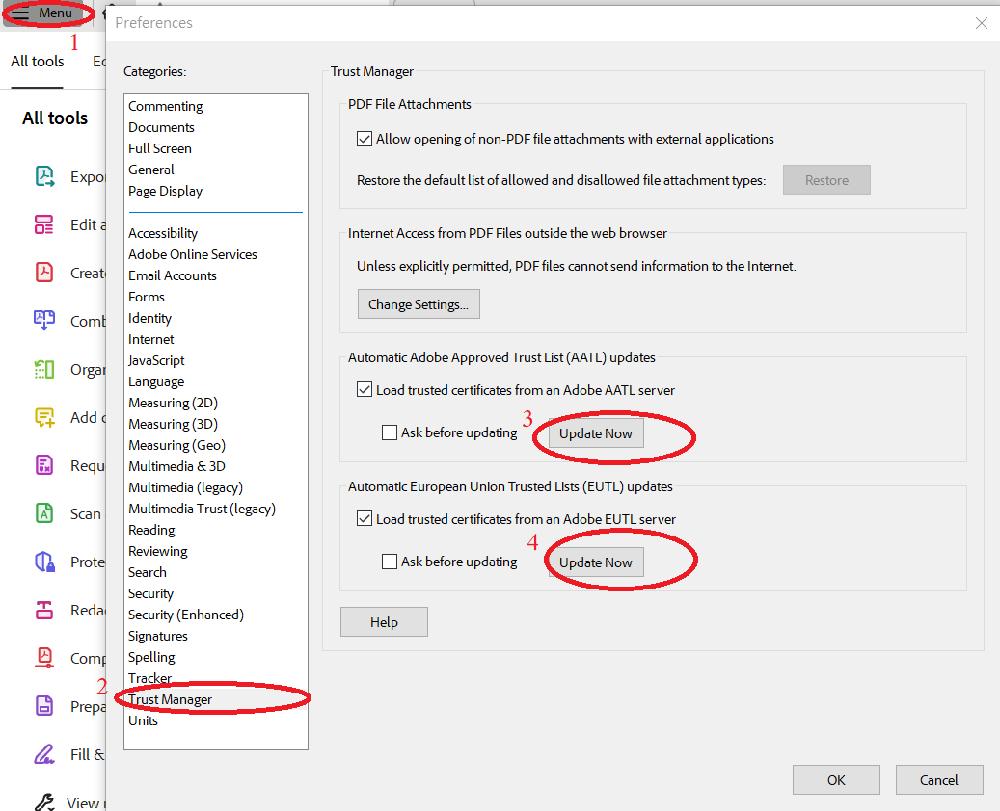
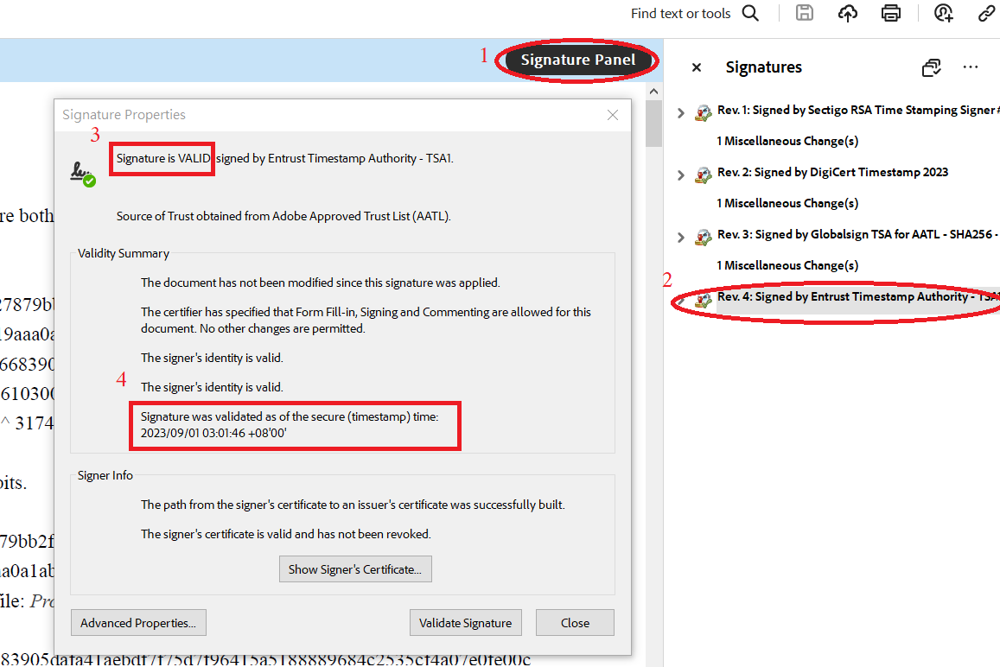

# A 32768 bit Safe Prime Number!
## What is Safe Prime Number?

See [here](https://en.wikipedia.org/wiki/Safe_and_Sophie_Germain_primes)

## The Cost

It took me about $60 and less than 2 days to find a 32768 bit Safe Prime Number. Although it is impossible to verify that the money I spent was $60, you can verify that the time I spent was less than 2 days. Because,  the Safe Prime Number is stamped with some Trusted Timestamp.

## Safe Prime Number
Let **SP = (A * (2 ^ 512) + B) * (2 ^ (32768 - 1024)) + FLOOR(Pi * (2 ^ (32768 - 1028))) + 977330979**. 
Where,  **A = 0xc4fb64db23427879bb2f2f92b2fa15034dbd4329f79a0de0ef6adef37014aaf0d58c350902cf73157fce19aaa0a1ab1091c6c35092dd4282eab42d5d49a247bd**,  **B = 0xc77066bc87016683905dafa41aebdf7f75d7f96415a5188889684c2535cf4a07e0fe00c27107710ae62661030001fe96a277598427ebb765faf96ef32df0f0b0**.   

A is the SHA512 Hash of file [Proof_of_date_and_time.txt](./docs/Proof_of_date_and_time.txt). The file includes some btc block information and a news report, so this file can prove that I started searching for the Safe Prime Number after the btc blocks was created. 
B is the SHA512 of the string: “TSAI, YI-JU From Taichung, Taiwan, Republic of China.”. It identifies the creator of the Safe Prime Number.  

Then, SP is a Safe Prime.  

And the [PDF](./docs/SAFEPRIME-32768-WITH-MULTITSA.pdf) was signed with some Trusted Timestamps. It can prove that the Safe Prime Number was found before the timestamps was created. You can use Adobe Acrobat (It is Free to use) to verify it.

## Other Safe Prime Number

The following numbers are also Safe Prime Numbers.

1. (A * (2 ^ 512) + B) * (2 ^ (32768 - 1024)) + FLOOR(Pi * (2 ^ (32768 - 1028))) + 977330979;
2. (A * (2 ^ 512) + B) * (2 ^ (24576 - 1024)) + FLOOR(Pi * (2 ^ (24576 - 1028))) + 544145466;
3. (A * (2 ^ 512) + B) * (2 ^ (16384 - 1024)) + FLOOR(Pi * (2 ^ (16384 - 1028))) + 236733719;
4. (A * (2 ^ 512) + B) * (2 ^ (12288 - 1024)) + FLOOR(Pi * (2 ^ (12288 - 1028))) + 50292397;
5. (A * (2 ^ 512) + B) * (2 ^ (8192 - 1024)) + FLOOR(Pi * (2 ^ (8192 - 1028))) + 9516212;
6. (A * (2 ^ 512) + B) * (2 ^ (6144 - 1024)) + FLOOR(Pi * (2 ^ (6144 - 1028))) + 636231;
7. (A * (2 ^ 512) + B) * (2 ^ (4096 - 1024)) + FLOOR(Pi * (2 ^ (4096 - 1028))) + 31960034;
8. (A * (2 ^ 512) + B) * (2 ^ (3072 - 1024)) + FLOOR(Pi * (2 ^ (3072 - 1028))) + 3612998;
9. (A * (2 ^ 512) + B) * (2 ^ (2048 - 1024)) + FLOOR(Pi * (2 ^ (2048 - 1028))) + 7786197;
10. (A * (2 ^ 512) + B) * (2 ^ (1536 - 1024)) + FLOOR(Pi * (2 ^ (1536 - 1028))) + 9086642.

## Verify timestamps of the pdf

1. Install Adobe Acrobat
2. Click the menu, Click "Preferences", Click "Trust Manager", Click two "Update Now" to Update the AATL and EUTL.     
3. Restart Adobe Acrobat, Open the PDF, Click "Signature Panel", select a Signature, right click it and click "Show Signature Properties"     
